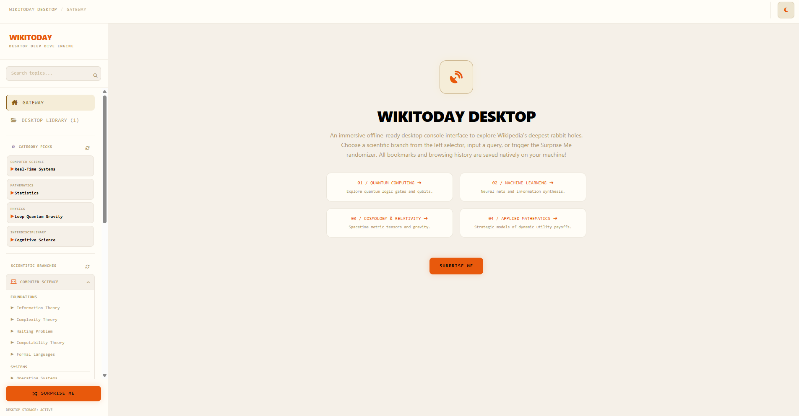

# WikiToday

WikiToday is a desktop and mobile reader client for Wikipedia built using Tauri, SvelteKit, and Rust. It features a custom reading theme, local storage capability, and responsive layout adjustments for smaller screens.

<p align="center">
  
  
</p>

<p align="center">
  
</p>

<p align="center">
  
</p>

## Features

* **Custom Reading Theme:** Built-in light and dark themes using the Lora serif font for the article content, styled first-letter drop caps, uppercase headers, and custom dotted underlines for links.
* **Responsive Sidebar Layout:** Disables floats and scales Wikipedia sidebars, templates, and infobox tables to full-width blocks on screen sizes smaller than `768px` to ensure standard reading layout on mobile devices.
* **Local Storage backend:** Saves bookmarks and reading history locally via Tauri's native Rust commands.
* **Basic Metrics & Tools:** Displays standard citation counters, coherence estimations, word counts, and an option to copy a BibTeX citation.

## Installation & Development

### Prerequisites
* [Node.js](https://nodejs.org/)
* [Rust & Cargo](https://www.rust-lang.org/)
* [Android Studio](https://developer.android.com/studio) (only required if building for Android)

### Run the Development Server
Starts the SvelteKit frontend and runs the Tauri wrapper:
```bash
npm run tauri dev
```

### Build Desktop Packages (Windows)
Compiles the application and generates the desktop installers:
```bash
npx tauri build
```
The output installers will be created at:
* **EXE Setup Installer:** `src-tauri/target/release/bundle/nsis/wikitoday_0.1.0_x64-setup.exe`
* **MSI Installer:** `src-tauri/target/release/bundle/msi/wikitoday_0.1.0_x64_en-US.msi`
* **Standalone Executable:** `src-tauri/target/release/wikitoday.exe`

### Build Android Package
To build the Android `.apk`:
1. Initialize the Android platform files:
   ```bash
   npx tauri android init
   ```
2. Set the SDK path variable if needed (example for Windows PowerShell):
   ```bash
   $env:ANDROID_HOME="C:\Users\<username>\AppData\Local\Android\Sdk"
   ```
3. Build the package:
   ```bash
   npx tauri android build
   ```

## Tech Stack
* **Frontend:** SvelteKit (Svelte 5) & Tailwind CSS v4
* **Backend Core:** Tauri v2 & Rust


